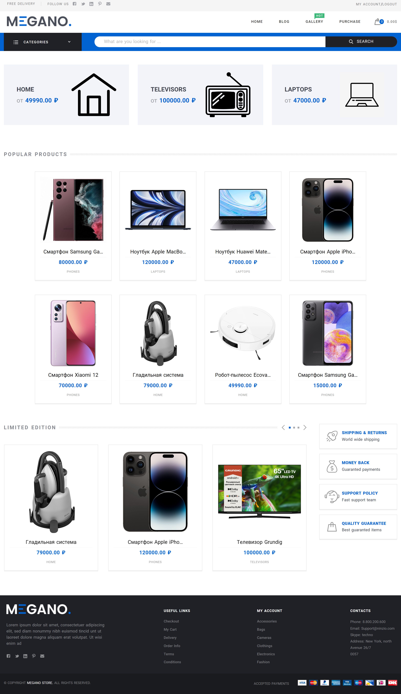

# Интернет магазин
***

## Общая информация
***
Проект разработан на фреймворке Django.

Запуск осуществляется путём кланирования репозитория, установки необходимых .env-опций и выполнения миграции.

## Структура проекта
***
### Проект состит из следующих частей
1. Приложения:
 - `application_settings` - приложение с служебными функциями и сервисами;
 - `products` - приложение с товарами магазина;
 - `store` - приложение магазина;
 - `users` - приложение пользователей;
2. Директории шаблонов:
 - `templates`;
3. Служебные директории:
 - `static` - статичные файлы сайта;
 - `media` - директория для загружаемых моделями файлов;
4. Директория настроек django-проекта:
 - `megano`;